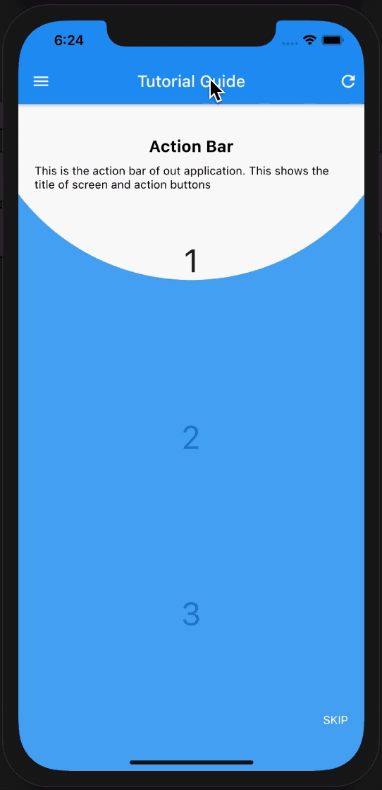

# Tutorial Guide

A tutorial is a method of transferring knowledge and may be used as a part of a learning process. In simple terms a small demo or introduction of how the process is/works. In mobile developement tutorials are often referred as `Coach Marks`. They highlight the given UI with some introductions. 

## Preview



Back to the topic, today we are going to learn about **tutorial_coach_mark** package in flutter.

`tutorial_coach_mark` is a Flutter library for creating beautiful and easy tutorials in flutter.

We will be building a simple `Tutorial Guide` app. In this we will providing introduction/information about various controls on the screen. Just a small app only for demonstration. No high expectations please. Haha!

Lets begin!!!

## Step 1 :  Install Packages

Place the below dependencies in your `pubspec.yaml` file and run `flutter pub get`
```

  tutorial_coach_mark: ^1.0.3

```

This is the main package for demonstration but we will add a few more to add some functionalitites to our app.

```

  fluttertoast: ^7.1.8

```


## Step 2 : Declare your variables

We will be needing a few variables as shown below which are self explanatory.

```dart
TutorialCoachMark tutorialCoachMark;
List<TargetFocus> targets = [];

//declare all keys
GlobalKey key1 = GlobalKey();
GlobalKey key2 = GlobalKey();
GlobalKey key3 = GlobalKey();
GlobalKey key4 = GlobalKey();
GlobalKey key5 = GlobalKey();
GlobalKey key6 = GlobalKey();
```

## Step 3 : Creating Tutorials

We have to define the turorial elements as well as the UI of the tutorial so consider the code below. We will add each `TargetFocus` into the list of TargetFocus that we created as `targets`. Here I will be showing to create only one. You can get into the code of `homepage.dart` and read the complete code from here.

```dart
/// create the coach marks here
void initTargets() {
targets.add(TargetFocus(
    identify: 'Target 1',
    keyTarget: key1,
    contents: [
    TargetContent(
        child: Container(
        child: Column(
            mainAxisSize: MainAxisSize.min,
            crossAxisAlignment: CrossAxisAlignment.center,
            mainAxisAlignment: MainAxisAlignment.center,
            children: <Widget>[
            Text(
                "Action Bar",
                style: TextStyle(
                    fontWeight: FontWeight.bold,
                    color: Colors.black,
                    fontSize: 20.0),
            ),
            Padding(
                padding: const EdgeInsets.only(top: 10.0),
                child: Text(
                "This is the action bar of out application. This shows the title of screen and action buttons",
                style: TextStyle(color: Colors.black),
                ),
            )
            ],
        ),
        ),
    ),
    ],
));
}
```

## Step 4 : Creating Our UI

```dart
@override
Widget build(BuildContext context) {
return Scaffold(
    appBar: AppBar(
    title: Text('Tutorial Guide'),
    centerTitle: true,
    key: key1,
    leading: Icon(
        Icons.menu,
        key: key2,
    ),
    actions: [
        InkWell(
        onTap: showTutorial,
        child: Padding(
            padding: const EdgeInsets.all(8.0),
            child: Icon(Icons.refresh),
            key: key3,
        ),
        )
    ],
    ),
    body: Center(
    child: Column(
        mainAxisAlignment: MainAxisAlignment.spaceEvenly,
        children: [
        Container(
            key: key4,
            child: Text(
            '1',
            style: TextStyle(fontSize: 40),
            ),
        ),
        Container(
            key: key5,
            child: Text(
            '2',
            style: TextStyle(fontSize: 40),
            ),
        ),
        Container(
            key: key6,
            child: Text(
            '3',
            style: TextStyle(fontSize: 40),
            ),
        )
        ],
    ),
    ),
);
}
```
## Step 5 : Initiate the tutorial guide and Calling it

First we will create a method to show the tutorial guide. 

```dart
void showTutorial() {
tutorialCoachMark = TutorialCoachMark(context,
    targets: targets,
    colorShadow: Colors.blue,
    textSkip: "SKIP",
    opacityShadow: 0.8, onSkip: () {
    Fluttertoast.showToast(
        msg: 'You have Skipped the Tutorial guide for this Application',
        toastLength: Toast.LENGTH_SHORT,
        gravity: ToastGravity.BOTTOM,
        backgroundColor: Colors.blue,
        textColor: Colors.white);
}, onFinish: () {
    Fluttertoast.showToast(
        msg: 'You have Finished the Tutorial guide for this Application',
        toastLength: Toast.LENGTH_SHORT,
        gravity: ToastGravity.BOTTOM,
        backgroundColor: Colors.blue,
        textColor: Colors.white);
})
    ..show();
}
```

Now that we have created the code to call our tutorial guide lets call it from the `initState` once our UI is completely built.

```dart
void _afterLayout(_) {
Future.delayed(Duration(seconds: 1));
showTutorial();
}

 @override
  void initState() {
    initTargets();
    WidgetsBinding.instance.addPostFrameCallback(_afterLayout);
    super.initState();
  }
```

One important thing to note here is to call the `showTutorial` method only when the UI is completely built. 

That's it folks! We're done with all the coding. Just go ahead and run your app!

Fantastic!! You have just learned how to create a tutorial in flutter.

## Important:

This repository is only for providing information on `tutorial_coach_mark`. Please do not misuse it.

## Author:

* [Amit Mishra](https://github.com/amitmishra7)

<<<<<<< HEAD
If you like this tutorial please don't forget to add a **Star**. Also follow to get informed for upcoming tutorials.
=======
If you like this tutorial please don't forget to add a **Star**. Also follow to get informed for upcoming tutorials.
>>>>>>> 562ac1f7994ee2f20ce0c7bb0c5e3c8d82d1ee14
